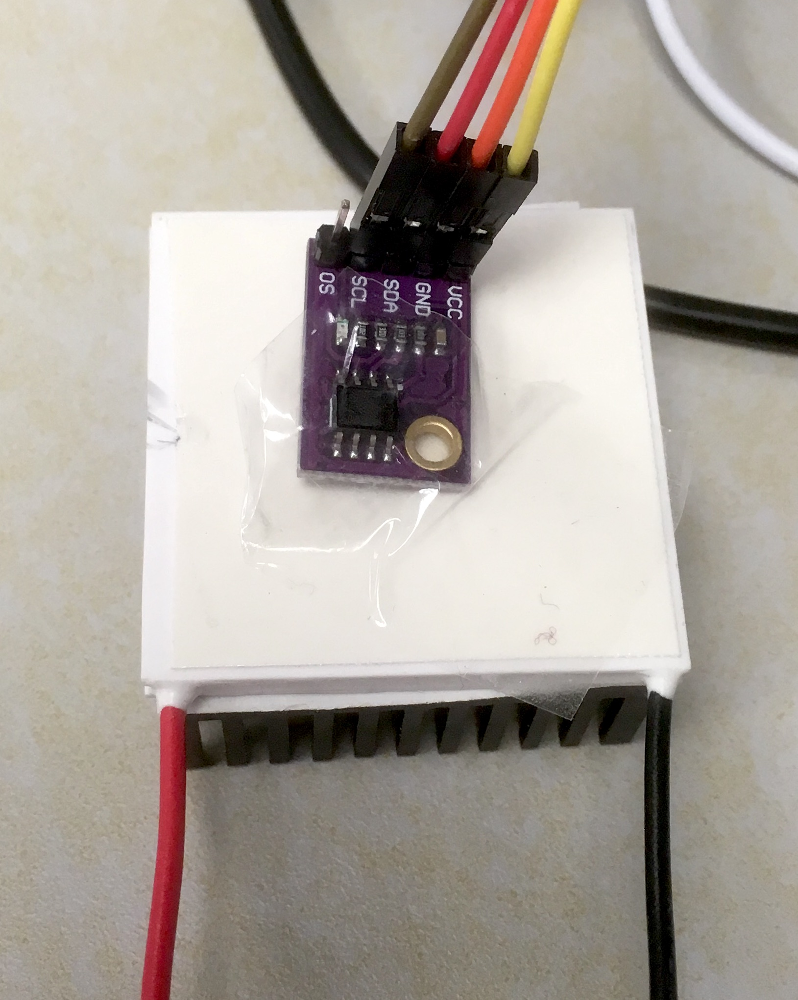

Peltier cells
=============

Preparation of a cell
---------------------

`Peltier cells <https://en.wikipedia.org/wiki/Thermoelectric_cooling>`_ use the `Peltier effect <https://en.wikipedia.org/wiki/Thermoelectric_effect#Peltier_effect>`_ to pump heat from one plate to another of the device. The flux of heat is roughly proportional to the current passing through the peltier cell. The image below provides a schematic representation of a Peltier cell.

.. figure:: https://upload.wikimedia.org/wikipedia/commons/a/a2/Peltierelement.png
   :scale: 50 %
   :alt: Peltier cell

   Peltier cell. Source: Wikipedia

- One of the two plates of the Peltier cell is engineered to be hot. The other to be cold. Please attach the thermal adesive on both sides, then attach the heat sink to the cold side. To identify the hot side please refer to the :download:`datasheet <docs/peltier_datasheet.pdf>`. For the particular model provided, place the cell on the bench/desk with the black cable on the right/down and red cable on the left/down, then the top plate is the hot plate. 

- Connect the Peltier cell to the H-bridge output. Set the power supply to 9 V and 3 A max. Reuse the code you wrote in the previous section to test the Peltier cell and make sure that the cold side get cooler, and how side warmer when the load is positive. If it works the otherway around, either you change your code, or you switch the cable of the Peltier cell.

- Place the Peltier cell on your desk/bench with the heat sink in contact with the bench surface and the hot side exposed to the air. Then place the temperature sensor on the hot side (fix it with standard tape).

   Peltier bench realization.

Constant heat transfer and sensor readings
------------------------------------------

The following code drives the Peltier cell with a small voltage and monitors the temperature of the cold side of the Peltier cell by cyclically reading the temperature sensor. Temperature sensor reading is made available to the user through serial.

The code to drive the Peltier cell is similar to the one for LED and motor. 
Setting and reading of the temperature sensor is realized through minor adaptations of the code you have developed in Activity 2. In fact, you will need to connect the temperature sensor to the pins **D14** and **D15** as in Activity 2.

The code uses the `Ticker <https://os.mbed.com/docs/mbed-os/v5.13/apis/ticker.html>`_ interface to set up recurring interrupts. Recurrent interrupts allow to read sensors and send information on the serial port at precise time intervals. 

   .. code-block:: c

	#include "mbed.h"
	#include "stdint.h"

    // Pins used for the H-bridge control
    PwmOut pwmload(D11);
    DigitalOut in_A(D8);
    DigitalOut in_B(D9);

	// *** Temperature sensor: pins and variables 
	#define LM75_REG_TEMP (0x00) // Temperature Register
	#define LM75_REG_CONF (0x00) // Configuration Register
	#define LM75_ADDR     (0x90) // LM75 address
	I2C i2c(I2C_SDA, I2C_SCL);  //D14 and D15
	Ticker dT_input;
	volatile int read_input = 0;  

	// *** Serial communication: variables 
	Serial pc(SERIAL_TX, SERIAL_RX);
	Ticker dT_serial;
	volatile int update_serial = 0;  

	// *** Interrupt functions 
	void sensing() {
		read_input = 1;
	}

	void serial_com() {
		update_serial = 1;
	}

	// *** General functions 

    void setload(float x)
    {
      if (x>0)
        { in_A = 1;
        in_B = 0;
        pwmload.write(x);
        pwmred.write(x);
        pwmblue.write(0.0);
        ledgreen = 0;
        }
      else if (x<0)
        { in_A = 0;
        in_B = 1;
        pwmload.write(-x);
        pwmred.write(0.0);
        pwmblue.write(-x);
        ledgreen = 0;
        }
      else
        { in_A = 0;
        in_B = 0;
        pwmload.write(0.0);
        pwmred.write(0.0);
        pwmblue.write(0.0);
        ledgreen = 1;
        }
    }

	float read_temperature() {
		// Read temperature register
		char data_write[2];
		char data_read[2];
		data_write[0] = LM75_REG_TEMP;
		i2c.write(LM75_ADDR, data_write, 1, 1); // no stop
		i2c.read(LM75_ADDR, data_read, 2, 0);

		// Calculate temperature value in Celcius
		int16_t i16 = (data_read[0] << 8) | data_read[1];
		// Read data as twos complement integer so sign is correct
		float temperature = i16 / 256.0;
		// Return temperature
		return temperature;   
	}

	int main() {

		//*** temperature sensing configuration 
		//Sensor configuration
		char data_write[2];
		data_write[0] = LM75_REG_CONF;
		data_write[1] = 0x02;
		i2c.write(LM75_ADDR, data_write, 2, 0);
		//variables
		float temperature = 0;
		
		//*** PWM drive configuration
		pwmload.period_us(1000);
		setload(0.1f); // Be careful not to set it too high
		printf("pwm set to %.2f %%\n", pwmload.read());

		//***  Interrupt configuration   
		dT_input.attach(sensing, 0.01);
		dT_serial.attach(serial_com, 0.25);
		
		while(1) {
			if (read_input == 1) {
				read_input = 0;
				temperature = read_temperature();             
			}
			if (update_serial == 1) {
				update_serial = 0;
				pc.printf("Pwm set to %.2f, Temperature = %.3f\r\n ",pwmload.read(), temperature); 
			}
		}   
	}

You will notice that serial communication happens at much slower rate than sensor reading. The reason for these differences will be clear later, when we will design a more complex actuation mechanism. The idea is that sensing and communication with the user can occur at different rates. Typically, sensing and actuation need a very fast rate to avoid issues but communication with the user (serial) can be done at a slower rate to save computational resources.

Finally, the while loop constantly monitors the two variables
``read_input`` and ``update_serial``. A sensor read is performed when ``read_input`` is detected equal to 1. Consequently, ``read_input`` is set to 0, in preparation for the next interrupt. Temperature and PWM status are communicated to the user when ``update_serial`` is detected equal to 1. After that, ``update_serial`` is set to 0, in preparation for the next interrupt.

.. admonition:: Task

   **Try the code above and monitor the temperature on the sensor. What relationship do you have between the duty cycle of the Peltier cell and the temperature? Make changes to the program and/or you circuit to cool the sensor rather than warm it up.**

