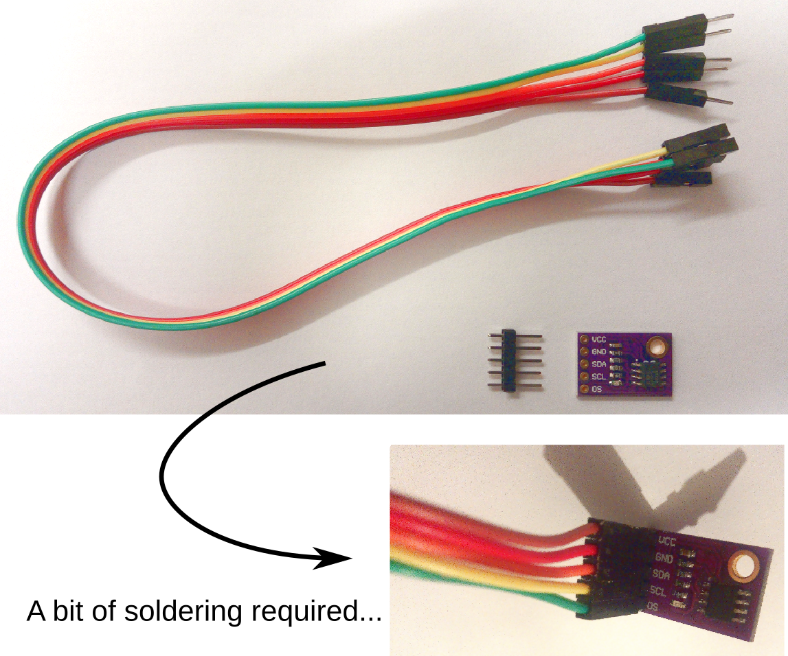

Soldering
=========

You need to solder the header pins to the breadboard, and set the address of your device by soldering each pin A0-A2 to ground (or VCC if you would like to use a different address).

Soldering is not difficult, but it is nonetheless a basic skill to learn.
In this section, you will find various videos and links to get you started with soldering if you are not familiar with it already.
The bottom of the page 

General information about soldering
-----------------------------------

Here is a good introductory video (http://www.youtube.com/embed/f95i88OSWB4), and a :download:`comic <docs/FullSolderComic_EN.PDF>` that will teach you what you need to get started.

.. raw:: html

   <iframe width="560" height="315" src="https://www.youtube.com/embed/f95i88OSWB4" frameborder="0" allowfullscreen></iframe>

This is a more advanced video (http://www.youtube.com/embed/t9LOtOBOTb0) that will show you many more soldering tips, certainly beyond what is needed here.

.. raw:: html

   <iframe width="560" height="315" src="http://www.youtube.com/embed/t9LOtOBOTb0" frameborder="0" allowfullscreen></iframe>

..

..

|
|

DIY in the EIETL
----------------

.. admonition:: Task

   **Book a slot in the EIETL weeks 5-8, solder the headers and set the I2C address of your device**

**How to book for a slot to solder the components?**

Please use `this link <http://to.eng.cam.ac.uk/teaching/apps/cuedle/index.php?context=HeaderSoldering>`_ to sign up for a slot at the soldering station.

**Where to find the soldering stations, and what equipment will you find there?**

Youtube link 1: http://www.youtube.com/embed/OauRHzzIPMk
Youtube link 2: http://www.youtube.com/embed/77X4XcjcQV0

.. raw:: html

   <iframe width="560" height="315" src="http://www.youtube.com/embed/OauRHzzIPMk" frameborder="0" allowfullscreen></iframe>

   <iframe width="560" height="315" src="http://www.youtube.com/embed/77X4XcjcQV0" frameborder="0" allowfullscreen></iframe>

Note the safety warning:

- The soldering iron will be hot!
- Make sure to start the fume extraction.
- Wear safety goggles.
- Use lead-free solder where possible. If using solder containing lead, make sure to wash your hands afterwards.

**Soldering the components**

Youtube link 1: http://www.youtube.com/embed/knjjIf9SR9c
Youtube link 2: http://www.youtube.com/embed/1SItk_6e-mc

.. raw:: html

   <iframe width="560" height="315" src="http://www.youtube.com/embed/knjjIf9SR9c" frameborder="0" allowfullscreen></iframe>

   <iframe width="560" height="315" src="http://www.youtube.com/embed/1SItk_6e-mc" frameborder="0" allowfullscreen></iframe>

.. DANGER::
   Be very careful not to shortcut VCC and GND when you connect the address pads. It is easy to link the three of them together if you are not paying attention. Such a shortcut will prevent the system to work, and would probably damage your board and/or sensor. So check that the soldering is fine, and use an R-meter to make sure that VCC is not connected to GND. 

**Have you made a mistake? Don't panic, and read below!**

**Removing solder**

Youtube link 1: http://www.youtube.com/embed/mcc2kdqpvKg
Youtube link 2: http://www.youtube.com/embed/pWi0EyEDnEU

.. raw:: html

   <iframe width="560" height="315" src="http://www.youtube.com/embed/mcc2kdqpvKg" frameborder="0" allowfullscreen></iframe>

   <iframe width="560" height="315" src="http://www.youtube.com/embed/pWi0EyEDnEU" frameborder="0" allowfullscreen></iframe>

|
|

The Science of soldering
------------------------

Did you know that the composition of Lead-based solder is determined to match a eutectic transition?
You can use your knowledge of Materials to understand how solder works!

Have a look at this nice page from `DoITPoMS - Cambridge University Materials Science <https://www.doitpoms.ac.uk/tlplib/phase-diagrams/uses.php>`_ on the science of soldering.
The `Wikipedia page on solder <https://en.wikipedia.org/wiki/Solder>`_  is very informative too.

.. admonition:: Task

   **Look at the lead-tin (Pb-Sn) phase diagram on your "teach yourself phase diagrams" handouts, and check on the Wikipedia page that the composition of lead-based solder used in electronics is eutectic.
   Find evidence that the composition of lead based solders used in plumbing tend to be set away from the eutectic point.**

Link to the relevant file of Moodle (2017): `teach yourself phase diagrams <https://www.vle.cam.ac.uk/mod/resource/view.php?id=452751>`_

